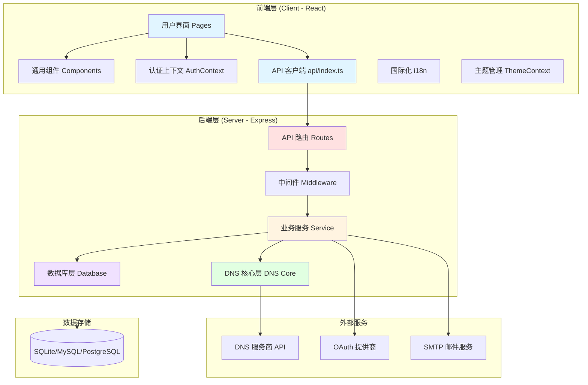
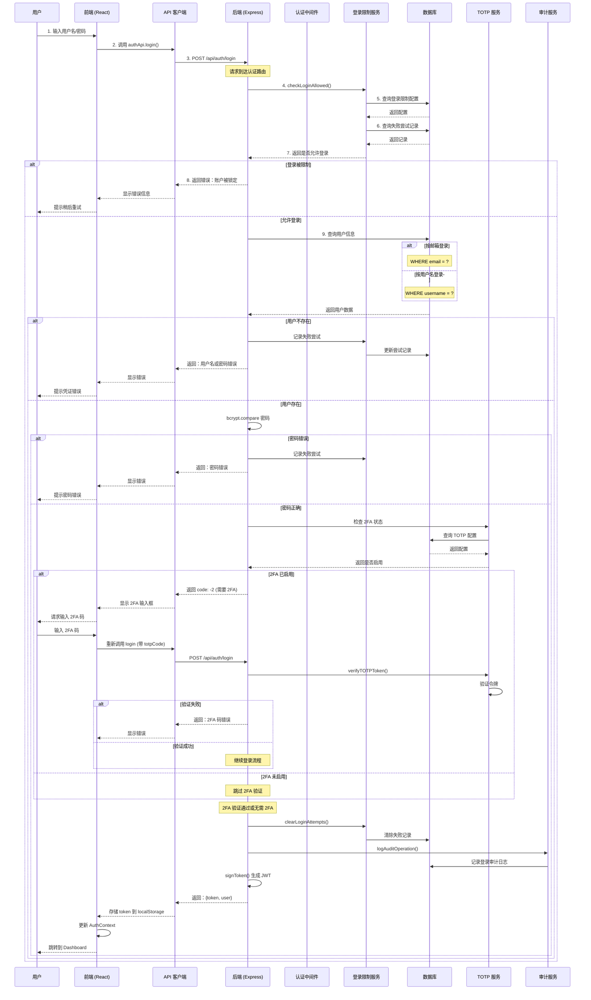
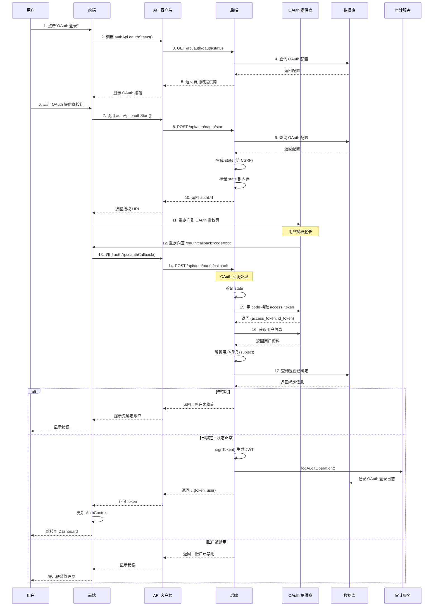
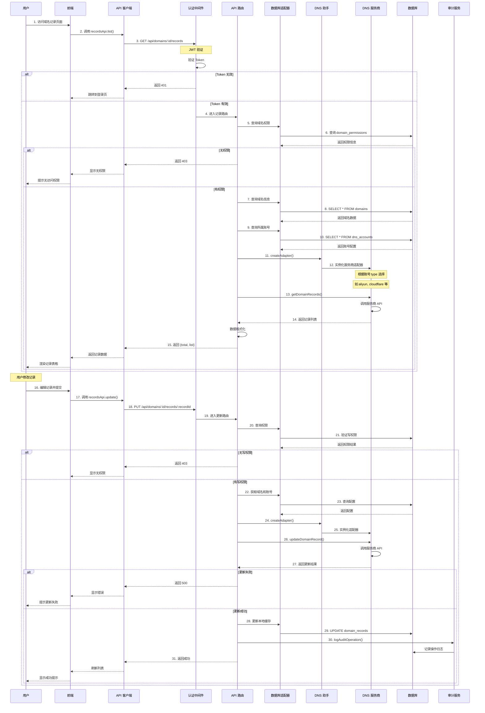
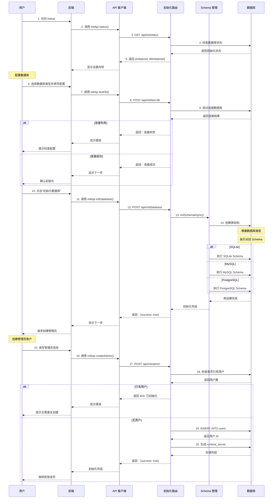
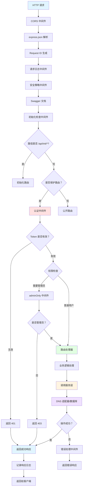
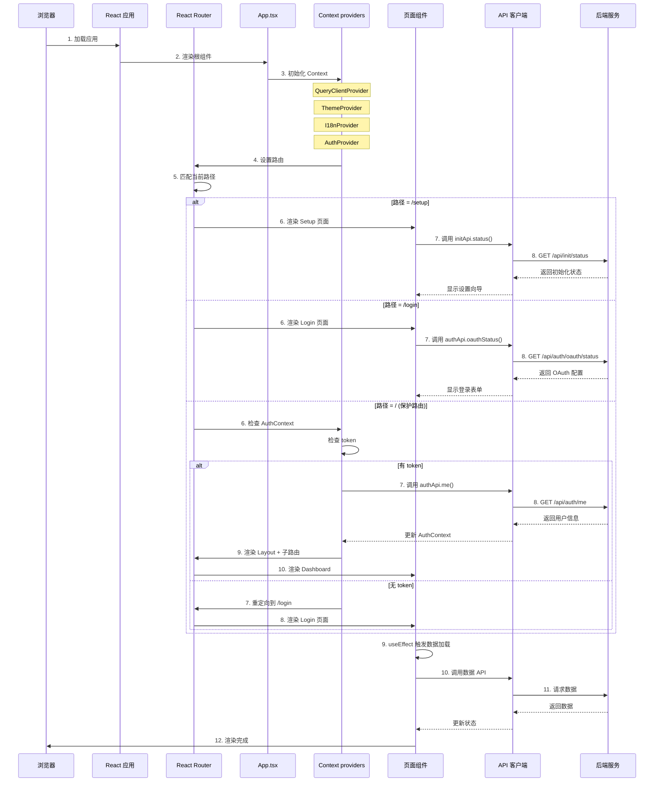

# DNSMgr 前后端调用流程与模块交互图

## 目录

- [整体架构图](#整体架构图)
- [用户登录流程](#用户登录流程)
- \[OAuth 登录流程]\(#oauth 登录流程)
- \[DNS 记录管理流程]\(#dns 记录管理流程)
- [数据库初始化流程](#数据库初始化流程)
- \[API 请求处理流程]\(#api 请求处理流程)
- [前端路由与页面加载流程](#前端路由与页面加载流程)

***

## 整体架构图



***

## 用户登录流程

### 完整调用链路



### 关键代码路径

```
前端调用链:
Login.tsx 
  → authApi.login() 
  → api.post('/auth/login') 
  → Axios 拦截器 (添加 Token)

后端处理链:
POST /api/auth/login (routes/auth.ts)
  → loginLimiter 中间件 (限流)
  → checkLoginAllowed() (service/loginLimit.ts)
  → db.get() 查询用户 (db/adapter.ts)
  → bcrypt.compareSync() 验证密码
  → getTOTPStatus() 检查 2FA (service/totp.ts)
  → verifyTOTPToken() 验证 2FA 码
  → clearLoginAttempts() 清除记录 (service/loginLimit.ts)
  → signToken() 生成 JWT (middleware/auth.ts)
  → logAuditOperation() 记录审计 (service/audit.ts)
  → 返回 {token, user}
```

***

## OAuth 登录流程

### 完整调用链路



### 关键代码路径

```Textile
OAuth 启动流程:
前端：
  Login.tsx/OAuthCallback.tsx
    → authApi.oauthStatus()
    → authApi.oauthStart(provider)

后端：
  GET /api/auth/oauth/status (routes/auth.ts:418)
    → getEnabledOAuthProviders()
      → getOAuthConfigByProvider()
        → db.get('SELECT value FROM system_settings WHERE key = ?')
  
  POST /api/auth/oauth/start (routes/auth.ts:467)
    → getOAuthConfigByProvider()
    → assertOAuthEnabled()
    → 生成 state 并存储
    → buildOauthAuthUrl()
    → 返回 authUrl

OAuth 回调流程:
  POST /api/auth/oauth/callback (routes/auth.ts:591)
    → 验证 state
    → exchangeOauthCode() 换取 token
    → fetchOAuthProfile() 获取用户信息
    → verifyIdToken() 验证 id_token
    → resolveOAuthSubject() 解析用户标识
    → resolveOAuthEmail() 解析邮箱
    → db.get() 查询 oauth_user_links
    → 检查绑定状态
    → signToken() 生成 JWT
    → logAuditOperation() 记录审计
    → 返回 {token, user}
```

***

## DNS 记录管理流程

### 完整调用链路



### 关键代码路径

```
获取记录列表:
前端：
  Records.tsx
    → useQuery(['records', domainId], () => recordsApi.list(domainId))
    → recordsApi.list(domainId, params)
    → api.get(`/domains/${domainId}/records`)

后端：
  GET /api/domains/:domainId/records (routes/records.ts)
    → authMiddleware (认证)
    → 检查域名权限
    → db.get() 查询域名信息
    → db.get() 查询账号配置
    → createAdapter() 创建 DNS 适配器
    → adapter.getDomainRecords() 调用服务商 API
    → 格式化返回数据
    → 返回 {total, list}

更新记录:
前端：
  RecordForm.tsx
    → recordsApi.update(domainId, recordId, data)
    → api.put(`/domains/${domainId}/records/${recordId}`)

后端：
  PUT /api/domains/:domainId/records/:recordId (routes/records.ts)
    → authMiddleware (认证)
    → 检查写权限
    → db.get() 查询域名和账号
    → createAdapter() 创建 DNS 适配器
    → adapter.updateDomainRecord() 调用服务商 API
    → db.execute() 更新本地数据库
    → logAuditOperation() 记录审计
    → 返回成功
```

***

## 数据库初始化流程

### 完整调用链路



### 关键代码路径

```
初始化状态检查:
前端：
  Setup.tsx
    → initApi.status()
    → api.get('/init/status')

后端：
  GET /api/init/status (routes/init.ts)
    → isDbInitialized() (db/database.ts)
      → 检查表是否存在
    → hasUsers() (db/database.ts)
      → SELECT COUNT(*) FROM users
    → 返回 {initialized, dbInitialized, hasUsers}

数据库初始化:
  POST /api/init/database (routes/init.ts)
    → createConnection() (db/database.ts)
      → 根据配置创建连接
    → initSchemaAsync() (db/schema.ts)
      → 根据 DB_TYPE 选择 Schema
      → schemas/sqlite.ts
      → schemas/mysql.ts
      → schemas/postgresql.ts
    → 执行 CREATE TABLE 语句
    → 返回 {success: true}

创建管理员:
  POST /api/init/admin (routes/init.ts)
    → hasUsers() 检查是否已有用户
    → bcrypt.hashSync() 加密密码
    → db.insert() 插入用户记录
    → 生成 runtime_secret
    → 返回 {success: true}
```

***

## API 请求处理流程

### 完整调用链路



### 中间件执行顺序

```
1. CORS 中间件 (cors)
   - 处理跨域请求

2. JSON 解析中间件 (express.json)
   - 解析 application/json 请求体

3. Request ID 中间件 (requestIdMiddleware)
   - 生成唯一请求 ID
   - 添加到请求头和响应头

4. 请求日志中间件 (requestLogger)
   - 记录请求开始时间
   - 监听响应完成事件
   - 记录请求方法、路径、状态码、耗时

5. 安全策略中间件
   - Content-Security-Policy
   - X-Content-Type-Options
   - X-Frame-Options
   - X-XSS-Protection
   - Referrer-Policy

6. 初始化检查中间件 (initCheckMiddleware)
   - 检查系统是否已初始化
   - 未初始化时返回 503

7. 认证中间件 (authMiddleware)
   - 提取 Bearer Token
   - 验证 JWT 或 API Token
   - 附加用户信息到 req.user

8. 权限检查中间件 (adminOnly 等)
   - 检查用户角色
   - 验证资源访问权限

9. 路由处理器 (Route Handler)
   - 处理业务逻辑
   - 调用服务层
   - 返回响应

10. 错误处理中间件 (errorHandler)
    - 捕获未处理错误
    - 格式化错误响应
    - 记录错误日志
```

***

## 前端路由与页面加载流程

### 应用启动流程



### 保护路由机制

```
前端路由守卫 (ProtectedRoute.tsx):

1. 检查 AuthContext 中的 user 状态
   - 如果 user === null 且 loading === false
     → 重定向到 /login
   
2. 如果 user 存在
   → 渲染子路由 (Outlet)

3. 管理员路由守卫 (AdminRoute.tsx):
   - 检查 user.role >= 2
   - 如果不是管理员
     → 重定向到 / (403)
   - 如果是
     → 渲染子路由

路由配置 (App.tsx):

<BrowserRouter>
  <Routes>
    {/* 公开路由 */}
    <Route path="/setup" element={<Setup />} />
    <Route path="/login" element={<Login />} />
    <Route path="/oauth/callback" element={<OAuthCallback />} />
    
    {/* 保护路由 */}
    <Route element={<ProtectedRoute />}>
      <Route element={<Layout />}>
        <Route index element={<Dashboard />} />
        <Route path="accounts" element={<Accounts />} />
        <Route path="domains" element={<Domains />} />
        <Route path="domains/:id/records" element={<Records />} />
        
        {/* 管理员路由 */}
        <Route element={<AdminRoute />}>
          <Route path="users" element={<Users />} />
          <Route path="audit" element={<Audit />} />
          <Route path="system" element={<System />} />
        </Route>
      </Route>
    </Route>
    
    {/* 404 重定向 */}
    <Route path="*" element={<Navigate to="/" replace />} />
  </Routes>
</BrowserRouter>
```

***

## 附录：关键数据流

### 用户登录数据流

```
用户输入
  ↓
前端表单验证
  ↓
authApi.login(username, password)
  ↓
POST /api/auth/login
  ↓
[后端] loginLimiter 中间件
  ↓
[后端] checkLoginAllowed() - 检查登录限制
  ↓
[后端] db.get() - 查询用户
  ↓
[后端] bcrypt.compare() - 验证密码
  ↓
[后端] getTOTPStatus() - 检查 2FA
  ↓
[后端] verifyTOTPToken() - 验证 2FA 码 (如果需要)
  ↓
[后端] clearLoginAttempts() - 清除失败记录
  ↓
[后端] signToken() - 生成 JWT
  ↓
[后端] logAuditOperation() - 记录审计日志
  ↓
返回 {token, user}
  ↓
前端存储 token 到 localStorage
  ↓
更新 AuthContext
  ↓
重定向到 Dashboard
```

### DNS 记录创建数据流

```
用户填写记录表单
  ↓
前端表单验证
  ↓
recordsApi.create(domainId, recordData)
  ↓
POST /api/domains/:domainId/records
  ↓
[后端] authMiddleware - JWT 验证
  ↓
[后端] 检查域名权限
  ↓
[后端] db.get() - 查询域名信息
  ↓
[后端] db.get() - 查询账号配置
  ↓
[后端] createAdapter() - 创建 DNS 适配器
  ↓
[后端] adapter.addDomainRecord() - 调用服务商 API
  ↓
[后端] db.insert() - 更新本地数据库
  ↓
[后端] logAuditOperation() - 记录审计日志
  ↓
返回 {id}
  ↓
前端刷新记录列表
  ↓
显示成功提示
```

***

## 总结

本文档详细描述了 DNSMgr 项目的前后端调用流程和各模块的交互逻辑，包括：

1. **整体架构**：前后端分离，通过 RESTful API 通信
2. **认证流程**：支持用户名密码、OAuth、2FA 多种认证方式
3. **DNS 管理**：通过适配器模式统一管理多个 DNS 服务商
4. **权限控制**：基于 RBAC 的权限模型，支持团队和域名级别授权
5. **数据流**：完整的请求 - 响应链路，包含中间件处理、业务逻辑、数据库操作

所有流程都遵循以下设计原则：

- **分层架构**：路由层 → 服务层 → 数据访问层
- **统一认证**：所有 API 请求都经过认证中间件
- **审计日志**：关键操作都记录审计日志
- **错误处理**：统一的错误处理中间件
- **限流保护**：登录、注册等接口有限流保护

