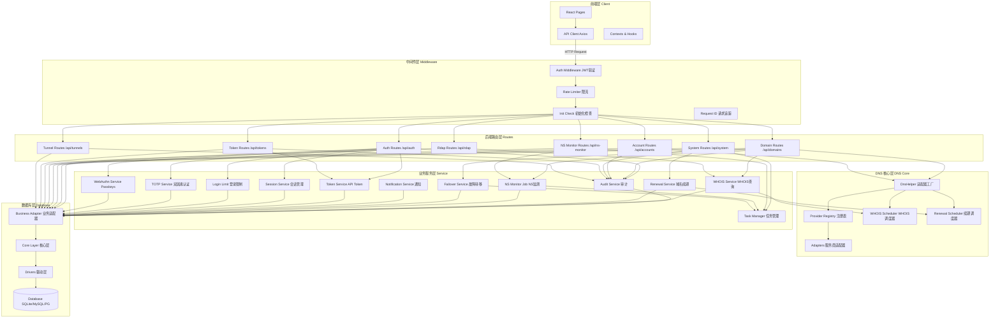

# 模块交互与调度图

## 模块交互总览



## 数据流详细说明

### 认证数据流

```
用户请求 
  → Auth Middleware (JWT 验证)
  → Auth Routes (/api/auth/*)
  → Session Service / Token Service
  → Business Adapter (query/get)
  → Database (users/sessions/api_tokens 表)
  → 返回用户信息或 Token
```

**关键文件:**
- `server/src/routes/auth.ts`
- `server/src/middleware/auth.ts`
- `server/src/service/session.ts`
- `server/src/service/token.ts`

### DNS 记录操作数据流

```
用户请求 
  → Auth Middleware (JWT 验证)
  → Domain Routes (/api/domains/:id/records)
  → Permission Check (检查域名权限)
  → Business Adapter (查询域名和账号)
  → DnsHelper (createAdapter)
  → Provider Adapter (调用服务商 API)
  → 更新 DNS 记录
  → Business Adapter (更新本地缓存)
  → Audit Service (记录审计日志)
  → Database (domain_records/audit_logs 表)
  → 返回操作结果
```

**关键文件:**
- `server/src/routes/records.ts`
- `server/src/lib/dns/DnsHelper.ts`
- `server/src/lib/dns/providers/*.ts`
- `server/src/service/audit.ts`

### WHOIS 查询数据流

```
用户请求 
  → Rdap Routes (/api/rdap/:domain)
  → WHOIS Service (whoisService.ts)
  → WHOIS Scheduler (调度器接口)
  → DNS Provider WHOIS API
  → 第三方 WHOIS/RDAP (fallback)
  → Business Adapter (更新 whois_cache 表)
  → 返回 WHOIS 结果
```

**后台定时刷新:**
```
Task Manager (定时触发)
  → whoisJob.ts
  → 查询 pinned_domains
  → WHOIS Service
  → 更新 whois_cache
  → Notification Service (如有变更)
```

**关键文件:**
- `server/src/routes/rdap.ts`
- `server/src/service/whoisService.ts`
- `server/src/service/whoisScheduler.ts`
- `server/src/service/whoisJob.ts`

### 域名续期数据流

```
Task Manager (每天定时触发)
  → domainRenewalJob.ts
  → Business Adapter (查询 renewable_domains)
  → 过滤 enabled=1 且即将过期
  → Renewal Scheduler (调度器接口)
  → DNS Provider API (执行续期)
  → Business Adapter (更新 expires_at)
  → Notification Service (发送通知)
  → Audit Service (记录日志)
```

**关键文件:**
- `server/src/service/domainRenewalJob.ts`
- `server/src/service/renewalScheduler.ts`
- `server/src/lib/dns/providers/dnshe/scheduler.ts`

### NS 监测数据流

```
Task Manager (每 5 分钟触发)
  → nsMonitorJob.ts
  → Business Adapter (查询 ns_monitor_configs)
  → 并发控制 (最多 10 个并行)
  → DNS Query (查询当前 NS 记录)
  → 对比预期 NS
  
  alt NS 不匹配
    → Failover Service
    → Business Adapter (查询 failover_configs)
    → DnsHelper (创建适配器)
    → Provider Adapter (更新 DNS 记录)
    → Business Adapter (更新本地缓存)
    → Notification Service (发送告警)
    → Audit Service (记录日志)
  else NS 匹配
    → Business Adapter (记录正常状态)
  end
```

**关键文件:**
- `server/src/service/nsMonitorJob.ts`
- `server/src/service/failover.ts`
- `server/src/service/notification.ts`

### 定时任务数据流

```
Task Manager 
  → Scheduled Job (定时任务)
  → Query Database (Business Adapter)
  → Process Data (业务逻辑)
  → Call External API (如需要)
  → Update Database (Business Adapter)
  → Send Notification (如需要)
  → Log Audit (Audit Service)
```

**关键文件:**
- `server/src/service/taskManager.ts`
- `server/src/service/whoisJob.ts`
- `server/src/service/domainRenewalJob.ts`
- `server/src/service/nsMonitorJob.ts`
- `server/src/service/failoverJob.ts`

## 关键模块职责说明

| 模块 | 文件位置 | 职责 | 依赖 |
|------|---------|------|------|
| **Task Manager** | `service/taskManager.ts` | 统一管理后台任务并发与优先级 | node-cron, Database |
| **WHOIS Service** | `service/whoisService.ts` | WHOIS 查询与缓存管理 | WHOIS Scheduler, Database |
| **Renewal Service** | `service/renewalScheduler.ts` | 域名续期调度与执行 | Renewal Scheduler, Database |
| **NS Monitor Job** | `service/nsMonitorJob.ts` | NS 记录监测与告警 | Task Manager, Failover Service |
| **Failover Service** | `service/failover.ts` | 故障转移逻辑执行 | DNS Helper, Notification Service |
| **Audit Service** | `service/audit.ts` | 审计日志记录与导出 | Database, File System |
| **Notification Service** | `service/notification.ts` | 邮件/Webhook 通知 | SMTP, Database |
| **Token Service** | `service/token.ts` | API Token 管理 | Database, Crypto |
| **Session Service** | `service/session.ts` | 用户会话管理 | Database |
| **Login Limit** | `service/loginLimit.ts` | 登录限制与防暴力破解 | Database |
| **TOTP Service** | `service/totp.ts` | 双因素认证 | speakeasy, Database |
| **WebAuthn Service** | `service/webauthn.ts` | Passkeys 支持 | @simplewebauthn/server |
| **DnsHelper** | `lib/dns/DnsHelper.ts` | DNS 适配器工厂 | Provider Registry |
| **Provider Registry** | `lib/dns/providers/registry.ts` | 服务商注册表 | All Adapters |
| **Business Adapter** | `db/business-adapter.ts` | 数据库操作统一入口 | Core Layer, Drivers |

## 模块依赖关系

### 前端依赖

```
React Pages
  ↓
API Client (Axios)
  ↓
HTTP Request
  ↓
Backend Routes
```

### 后端依赖层次

```
Routes (路由层)
  ↓
Middleware (中间件层)
  ↓
Service (业务服务层)
  ↓
DNS Core / Business Adapter
  ↓
Database Core Layer
  ↓
Database Drivers
  ↓
Database (SQLite/MySQL/PostgreSQL)
```

### 服务间依赖

```
Task Manager
  ├─→ WHOIS Job
  ├─→ Renewal Job
  ├─→ NS Monitor Job
  └─→ Failover Job

NS Monitor Job
  └─→ Failover Service
       └─→ Notification Service

All Services
  └─→ Audit Service
  └─→ Business Adapter
```

## 并发控制机制

### 任务管理器并发策略

- **WHOIS 刷新**: 最多 5 个并行请求
- **NS 监测**: 最多 10 个并行请求
- **域名续期**: 串行执行（避免冲突）
- **故障转移**: 高优先级，可插队

### 实现方式

```typescript
// server/src/service/taskManager.ts
class TaskManager {
  private concurrency: Map<string, number> = new Map();
  private maxConcurrency: Map<string, number> = new Map();
  
  async execute(task: Task, priority: number): Promise<void> {
    // 检查并发限制
    if (this.isAtMaxConcurrency(task.type)) {
      await this.waitForSlot(task.type);
    }
    
    // 执行任务
    this.incrementConcurrency(task.type);
    try {
      await task.execute();
    } finally {
      this.decrementConcurrency(task.type);
    }
  }
}
```

## 错误处理与重试

### 统一错误处理

所有服务层操作都包含：
1. Try-Catch 包裹
2. 错误日志记录
3. 审计日志记录
4. 通知发送（如配置）

### 重试机制

- **WHOIS 查询**: 失败后重试 3 次，每次间隔 5 秒
- **DNS API 调用**: 失败后重试 2 次，每次间隔 3 秒
- **邮件发送**: 失败后重试 3 次，每次间隔 10 秒

## 性能优化

### 缓存策略

- **WHOIS 缓存**: 数据库存储，TTL 24 小时
- **DNS 记录缓存**: 内存缓存，TTL 5 分钟
- **用户会话**: Redis（可选）或数据库

### 批量操作

- **域名同步**: 批量获取域名列表
- **记录更新**: 批量提交变更记录
- **审计日志**: 批量写入数据库

### 异步处理

- **邮件发送**: 异步队列处理
- **通知推送**: 异步非阻塞
- **日志记录**: 异步写入

## 安全机制

### 认证与授权

- **JWT Token**: 双层密钥结构（JWT_SECRET + runtime_secret）
- **API Token**: 细粒度权限控制
- **OAuth2/OIDC**: 标准单点登录
- **WebAuthn**: 无密码登录

### 限流保护

- **登录限流**: 防止暴力破解
- **API 限流**: 防止 DDoS 攻击
- **任务限流**: 防止资源耗尽

### 审计追踪

- **所有关键操作**: 记录审计日志
- **登录尝试**: 记录成功/失败
- **数据变更**: 记录前后值
- **管理员操作**: 特别标记

## 扩展性设计

### 添加新 DNS 提供商

1. 创建适配器: `providers/myprovider/adapter.ts`
2. 注册服务商: `providers/registry.ts`
3. 导出适配器: `providers/index.ts`
4. （可选）实现调度器: `providers/myprovider/scheduler.ts`

### 添加新定时任务

1. 创建任务: `service/myJob.ts`
2. 注册任务: `service/taskManager.ts`
3. 配置间隔: 环境变量或数据库

### 添加新通知渠道

1. 实现接口: `service/notification.ts`
2. 添加配置: `system_settings` 表
3. 注册渠道: 通知服务配置

## 监控与日志

### 日志级别

- **DEBUG**: 详细调试信息
- **INFO**: 一般操作信息
- **WARN**: 警告信息
- **ERROR**: 错误信息

### 监控指标

- **任务执行时间**: 每个任务的耗时
- **API 响应时间**: 每个接口的耗时
- **数据库查询时间**: 慢查询检测
- **并发任务数**: 实时并发监控

### 日志位置

```
server/data/dnsmgr.log      # 应用日志
server/data/audit_*.json    # 审计日志
```
