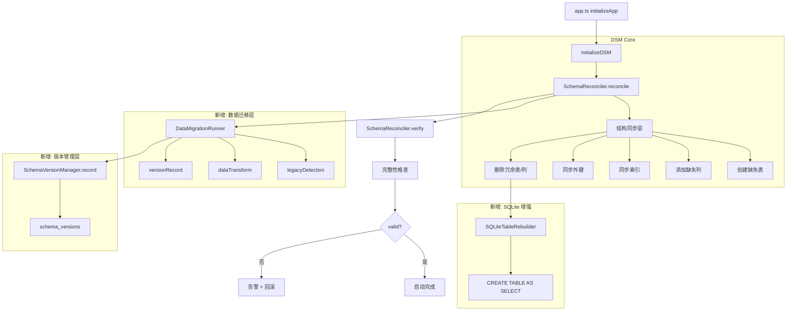

# DSM (Declarative Schema Management) 优化方案

**版本**: 2.0  
**状态**: ✅ 实施完成  
**最后更新**: 2026-06-01

---

## 1. 概述

### 1.1 当前状态

DSM（Declarative Schema Management）已作为 HiDNS 的主数据库初始化路径在 `app.ts` 中启用。当前架构：

```
app.ts → initializeDSM() → SchemaReconciler.reconcile(COMPLETE_SCHEMA)
                          → SchemaReconciler.verify(COMPLETE_SCHEMA)
```

DSM 采用声明式模式，通过 `COMPLETE_SCHEMA` 定义"目标状态"，由 `SchemaReconciler` 自动计算差异并同步。

### 1.2 现存差距

经过对旧迁移系统（`init.ts`、`schema.ts`）的全量审计，DSM 在以下方面仍有不足：

| 差距 | 严重程度 | 影响范围 | 状态 |
|------|----------|----------|------|
| 无数据迁移能力 | P0 | 遗留数据库升级 | ✅ 已实现 (DataMigrationRunner) |
| 无版本追踪 | P0 | 变更审计/回滚 | ✅ 已实现 (SchemaVersionManager) |
| 无遗留系统检测 | P1 | 旧版升级 | ✅ 已实现 (detectLegacySystem) |
| SQLite DDL 受限 | P1 | SQLite 用户 | ✅ 已实现 (Table Rebuild Mode) |
| 启动后残留旧初始化调用 | P2 | 安全策略/信任设备表 | ✅ 已清理 (app.ts) |
| 缺少 Schema 完整性审计 | P2 | 开发期验证 | ✅ 已实现 (auditSchema) |
| allowDropTable 默认关闭 | P3 | 废弃表清理 | ✅ 已升级为四级策略 |

### 1.3 优化目标

1. **补齐数据迁移能力** - 在 DSM 结构同步之上增加数据迁移通道
2. **建立版本追踪机制** - 将 DSM 的操作记录到 `schema_versions`
3. **增强 SQLite 兼容** - 通过表重建模式支持列删除和类型变更
4. **消除遗留系统风险** - 自动检测旧版并执行兼容迁移
5. **完全替代旧初始化路径** - 消灭 `securityPolicyTable` 等 Post-DSM 初始化

---

## 2. 架构优化

### 2.1 目标架构



### 2.2 文件变更清单

| 文件 | 操作 | 说明 |
|------|------|------|
| `db/init-dsm.ts` | 修改 | 增加数据迁移/版本追踪通道 |
| `db/schema-reconciler.ts` | 修改 | 增强 SQLite DDL、allowDropTable 安全策略 |
| `db/schemas/complete-schema.ts` | 修改 | Schema 版本号管理 |
| `db/data-migration-runner.ts` | 新增 | 数据迁移执行器 |
| `db/migration-manager.ts` | 修改 | 集成 DSM 版本记录 |
| `app.ts` | 修改 | 移除 Post-DSM 残留初始化 |

---

## 3. 详细优化方案

### 3.1 数据迁移层（P0）

#### 3.1.1 设计理念

DSM 负责**结构同步**，数据迁移层负责**数据转换**。两者分离但协同：结构对齐后，数据迁移层检查是否需要执行数据转换，最后统一记录版本。

#### 3.1.2 DataMigrationRunner

新建 `server/src/db/data-migration-runner.ts`：

```typescript
export interface DataMigration {
  id: string;           // 唯一标识，如 'migrate-dns-account-type'
  description: string;  // 人类可读描述
  dependsOn?: string[]; // 依赖的其他 migration ID
  condition: () => Promise<boolean>; // 执行条件检测
  execute: () => Promise<void>;      // 迁移逻辑
}

export class DataMigrationRunner {
  private migrations: DataMigration[] = [];
  
  register(migration: DataMigration): void;
  
  async run(options?: { dryRun?: boolean }): Promise<MigrationResult> {
    // 1. 从 schema_versions 读取已执行的 migration ID
    // 2. 筛选出未执行的 migration
    // 3. 按依赖顺序执行
    // 4. 记录成功/失败到 schema_versions
  }
}
```

#### 3.1.3 内置数据迁移清单

从旧系统迁移过来，需要注册以下数据迁移：

| 迁移 ID | 描述 | 条件 | 操作 |
|---------|------|------|------|
| `migrate-dns-account-type` | dnsmgr → hidns | `SELECT COUNT(*) FROM dns_accounts WHERE type='dnsmgr'` | `UPDATE dns_accounts SET type='hidns' WHERE type='dnsmgr'` |
| `migrate-ns-domain-name` | 填充 ns_monitor_domains.domain_name | domain_name 列为空 | 从 domains 表 JOIN 更新 |
| `migrate-user-totp-webauthn` | 合并 legacy 认证表 | `user_totp` 表存在 | 将数据迁移到 `user_2fa` 和 `webauthn_credentials` |
| `migrate-create-system-settings` | 初始化默认系统设置 | system_settings 为空 | 写入默认配置 |
| `migrate-security-policies` | 初始化默认安全策略 | security_policies 为空 | 插入默认行 |

#### 3.1.4 调用入口

在 [init-dsm.ts](file:///c:/Users/HINS/Documents/Trae/DNSMgr-1/server/src/db/init-dsm.ts) 中增强：

```typescript
export async function initializeDSM(dryRun = false): Promise<void> {
  const reconciler = new SchemaReconciler();

  // Phase 1: 结构同步（现有逻辑）
  await reconciler.reconcile(COMPLETE_SCHEMA, { dryRun });

  // Phase 2: 数据迁移（新增）
  if (!dryRun) {
    const runner = new DataMigrationRunner();
    registerMigrations(runner);
    await runner.run();
  }

  // Phase 3: 完整性自检（现有逻辑）
  if (!dryRun) {
    const check = await reconciler.verify(COMPLETE_SCHEMA);
    // ...
  }

  // Phase 4: 版本记录（新增）
  if (!dryRun) {
    await recordDSMVersion(COMPLETE_SCHEMA.version);
  }
}
```

### 3.2 版本追踪机制（P0）

#### 3.2.1 当前问题

- DSM 执行后不从 `schema_versions` 表
- 无法判断当前数据库是否是 DSM 管理
- 无法回滚或查看历史变更

#### 3.2.2 解决方案

在 [migration-manager.ts](file:///c:/Users/HINS/Documents/Trae/DNSMgr-1/server/src/db/migration-manager.ts) 中新增 DSM 专用方法：

```typescript
export class SchemaVersionManager {
  // 现有方法...

  /**
   * 记录 DSM 版本（使用 COMPLETE_SCHEMA 的 version 字符串）
   */
  async recordDSMVersion(schemaVersion: string): Promise<void> {
    // 使用 semantic_version 字段存储 '1.7.2'
    // 使用 version 字段存储 schema hash
    const exists = await this.isDSMVersionRecorded(schemaVersion);
    if (!exists) {
      await this.conn.execute(
        `INSERT INTO schema_versions 
         (version, semantic_version, description, success, execution_time_ms, system_type)
         VALUES (?, ?, ?, 1, 0, 'hidns-dsm')`,
        [this.schemaHash, schemaVersion, `DSM schema ${schemaVersion}`]
      );
    }
  }

  /**
   * 检查 DSM 版本是否已记录
   */
  async isDSMVersionRecorded(schemaVersion: string): Promise<boolean> {
    const result = await this.conn.get(
      `SELECT COUNT(*) as cnt FROM schema_versions 
       WHERE semantic_version = ? AND system_type = 'hidns-dsm'`,
      [schemaVersion]
    );
    return (result as any)?.cnt > 0;
  }
}
```

### 3.3 SQLite DDL 增强（P1）

#### 3.3.1 当前局限

[SchemaReconciler](file:///c:/Users/HINS/Documents/Trae/DNSMgr-1/server/src/db/schema-reconciler.ts) 的 `dropColumn()` 在 SQLite 下仅打印警告，`modifyColumnType()` 直接报错。

#### 3.3.2 表重建模式

为 SQLite 实现完整的列删除和类型变更支持，核心逻辑：

```typescript
private async rebuildTableForSQLite(
  tableName: string,
  targetColumns: ColumnDef[],
  dropColumns?: string[],
  dryRun: boolean
): Promise<void> {
  // 1. 获取现有列
  const existingCols = await this.getTableColumns(tableName);
  
  // 2. 计算保留的列（目标列 - 要删除的列）
  const keepCols = targetColumns
    .filter(c => !dropColumns?.includes(c.name))
    .map(c => this.escapeIdentifier(c.name));
  
  // 3. 计算新列定义
  const newColDefs = targetColumns
    .filter(c => !dropColumns?.includes(c.name))
    .map(c => this.getColumnDefinitionSQL(c));
  
  // 4. 表重建（事务保护）
  const tempName = `${tableName}_dsm_rebuild`;
  
  await this.execute(`CREATE TABLE ${tempName} (${newColDefs.join(', ')})`);
  await this.execute(`INSERT INTO ${tempName} (${keepCols.join(', ')})
    SELECT ${keepCols.join(', ')} FROM ${this.escapeIdentifier(tableName)}`);
  await this.execute(`DROP TABLE ${this.escapeIdentifier(tableName)}`);
  await this.execute(`ALTER TABLE ${tempName} RENAME TO ${this.escapeIdentifier(tableName)}`);
  
  // 5. 重建索引
  for (const idx of targetColumns.find(t => t.name === tableName)?.indexes || []) {
    await this.execute(`CREATE INDEX IF NOT EXISTS ${idx.name} ON ${tableName}(${idx.columns.join(', ')})`);
  }
}
```

#### 3.3.3 集成到 syncColumns

修改 `syncColumns()` 方法：当检测到 SQLite 且需要 `DROP COLUMN` 或列类型变更时，自动切换到表重建模式而不是报错。

### 3.4 遗留系统检测（P1）

#### 3.4.1 检测触发器

在 DSM 的 `reconcile()` 执行前，增加一个检测阶段：

```typescript
private async detectLegacySystem(): Promise<LegacyInfo | null> {
  const type = this.conn.type;
  
  // 检测标志：4 张核心表存在但无 schema_versions
  const coreTables = ['domains', 'users', 'ns_monitor_domains'];
  let coreCount = 0;
  for (const table of coreTables) {
    if (await this.tableExists(table)) coreCount++;
  }
  
  if (coreCount >= 3) {
    const versionTableExists = await this.tableExists('schema_versions');
    if (!versionTableExists) {
      return { type: 'legacy_no_version', coreTables: coreCount };
    }
    
    // 有版本表但不是 HiDNS
    const isHiDNS = await this.checkHiDNSMarker();
    if (!isHiDNS) {
      return { type: 'legacy_other_system' };
    }
  }
  
  return null;
}
```

#### 3.4.2 升级路径

检测到遗留系统时：
1. 记录日志，标记为遗留升级模式
2. 先执行一次 `COMPLETE_SCHEMA` 的完整结构同步（DSM 现有逻辑）
3. 再执行数据迁移（新增的数据迁移层）
4. 写入 `schema_versions` 标记升级完成

### 3.5 移除 Post-DSM 残留初始化（P2）

#### 3.5.1 当前问题

在 [app.ts](file:///c:/Users/HINS/Documents/Trae/DNSMgr-1/server/src/app.ts) 中，DSM 执行后仍有残留调用：

```typescript
// 初始化安全相关表（已迁移至 DSM 统一管理）
await initSecurityPolicyTable();   // 应移除
await initTrustedDevicesTable();   // 应移除
```

这些表在 `COMPLETE_SCHEMA` 中已有完整定义（`security_policies`、`user_security_settings`、`trusted_devices`），DSM 已自动创建。

#### 3.5.2 行动清单

| 文件 | 行号 | 当前代码 | 改为 |
|------|------|----------|------|
| [app.ts](file:///c:/Users/HINS/Documents/Trae/DNSMgr-1/server/src/app.ts) | L461 | `await initSecurityPolicyTable()` | 移除 |
| [app.ts](file:///c:/Users/HINS/Documents/Trae/DNSMgr-1/server/src/app.ts) | L462 | `await initTrustedDevicesTable()` | 移除 |
| [app.ts](file:///c:/Users/HINS/Documents/Trae/DNSMgr-1/server/src/app.ts) | L505-506 | 同上（第二次初始化分支） | 移除 |
| [app.ts](file:///c:/Users/HINS/Documents/Trae/DNSMgr-1/server/src/app.ts) | L559-560 | 同上（catch 分支） | 移除 |
| [app.ts](file:///c:/Users/HINS/Documents/Trae/DNSMgr-1/server/src/app.ts) | L18 | `import { initializeDSM }` 保留 | 无变化 |

#### 3.5.3 数据兜底

移除上述调用后，需确保初始化向导（`POST /api/init/admin`）能完成相同功能。检查 `init.ts` 路由：

```typescript
// 检查 POST /api/init/admin 中是否调用了安全策略初始化
// 如果没有，在创建管理员后补充一次默认安全策略写入
if (!dryRun) {
  await insertDefaultSecurityPolicy(); // 通过 DataMigrationRunner 注册
}
```

将默认安全策略的初始化放入数据迁移层（`migrate-security-policies`），确保新装和升级都能自动完成。

### 3.6 Schema 版本号管理（P2）

#### 3.6.1 当前问题

[complete-schema.ts](file:///c:/Users/HINS/Documents/Trae/DNSMgr-1/server/src/db/schemas/complete-schema.ts) 中 `version: '1.7.2'` 是写死的字符串，不支持自动更新。

#### 3.6.2 版本号策略

```typescript
export const COMPLETE_SCHEMA: DatabaseSchema = {
  version: '1.7.2',  // 手动更新：修改前 +0.0.1
  tables: [...]
};
```

采用语义化版本策略：

| 变更类型 | 版本更新 | 示例 |
|----------|----------|------|
| 新增表 | +0.1.0 | 1.7.2 → 1.8.0 |
| 新增列/索引 | +0.0.1 | 1.7.2 → 1.7.3 |
| 修改列类型 | +0.0.1 | 1.7.2 → 1.7.3 |
| 删除表/列 | +1.0.0（破坏性变更） | 1.7.2 → 2.0.0 |

#### 3.6.3 Schema Hash 集成

保留现有的 `SchemaVersionManager.getCurrentVersion()` 机制，同时记录语义版本：

```
schema_versions 表记录:
  version:          'a1b2c3d4e5f6g789' (schema hash)
  semantic_version: '1.7.2'           (语义版本)
  system_type:      'hidns-dsm'        (标识 DSM 管理)
```

这样既可检测到 Schema 的任意更改（hash 变化），又可追踪发布版本。

### 3.7 allowDropTable 安全策略（P3）

#### 3.7.1 当前行为

`reconcile()` 的 `allowDropTable` 默认为 `false`，永远不会删除废弃表。

#### 3.7.2 优化策略

改为三级安全模式：

```typescript
export type DropTablePolicy = 'never' | 'dry-run-only' | 'safe-only' | 'always';

interface ReconcileOptions {
  dropTablePolicy?: DropTablePolicy;
  // ...
}
```

| 模式 | 行为 | 适用场景 |
|------|------|----------|
| `never`（默认） | 不检测也不删除 | 生产环境通用 |
| `dry-run-only` | 日志警告但不执行 | 首次部署检查 |
| `safe-only` | 只删除空表（SELECT COUNT(*) = 0） | 迁移后清理 |
| `always` | 删除所有不在 Schema 中的表 | 开发/测试环境 |

---

## 4. 实施路线图

### 4.1 阶段划分

| 阶段 | 内容 | 预估工作量 | 风险等级 | 状态 |
|------|------|------------|----------|------|
| **Phase 1** | 数据迁移层 + 版本追踪 | 3-4 天 | 低 | ✅ 已完成 |
| **Phase 2** | SQLite 表重建 + Post-DSM 清理 | 2-3 天 | 中 | ✅ 已完成 |
| **Phase 3** | 遗留系统检测 + Schema 审计 | 2 天 | 低 | ✅ 已完成 |
| **Phase 4** | allowDropTable 策略 + 测试覆盖 | 1-2 天 | 低 | ✅ 已完成 |

### 4.2 Phase 1 详细任务

#### Day 1: DataMigrationRunner

1. 新建 `server/src/db/data-migration-runner.ts`
2. 实现 `DataMigration` 接口和 `DataMigrationRunner` 类
3. 实现迁移依赖排序（拓扑排序）
4. 实现 `schema_versions` 读写集成
5. 单元测试覆盖

#### Day 2: 注册内置数据迁移

1. 迁移 `migrate-dns-account-type`：`dnsmgr` → `hidns`
2. 迁移 `migrate-ns-domain-name`：填充 `domain_name`
3. 迁移 `migrate-security-policies`：默认安全策略
4. 集成到 `init-dsm.ts` 的 Phase 2

#### Day 3: SchemaVersionManager 增强 + 集成测试

1. 添加 `recordDSMVersion()`、`isDSMVersionRecorded()`
2. 数据迁移层集成版本记录
3. 端到端测试：新装 / 升级 / 遗留升级

### 4.3 Phase 2 详细任务

#### Day 1: SQLite 表重建

1. 在 `SchemaReconciler` 中实现 `rebuildTableForSQLite()`
2. 修改 `syncColumns()` 检测 SQLite + DDL 受限场景，自动切换到表重建
3. 事务保护：表重建过程中失败自动回滚
4. 集成 `BackupManager` 在重建前创建备份

#### Day 2: Post-DSM 残留清理

1. 检查 `initSecurityPolicyTable()` 的完整逻辑
2. 如果包含数据写入，迁移到 `DataMigrationRunner`
3. 在 `app.ts` 中移除所有残留调用
4. 验证初始化向导仍然能正确创建管理员

### 4.4 Phase 3 详细任务

#### Day 1: 遗留系统检测 + 审计

1. 在 `SchemaReconciler` 中实现 `detectLegacySystem()`
2. 集成到 `reconcile()` 的入口检测
3. 编写 Schema 审计脚本（`npm run schema:audit`）
4. 审计脚本输出：表覆盖率、列覆盖、索引覆盖

### 4.5 Phase 4 详细任务

#### Day 1: Drop Table 策略 + 测试

1. 实现三级安全模式
2. 实现 `safe-only` 模式的空表检测
3. 编写测试用例

---

## 5. 测试策略

### 5.1 单元测试

| 测试目标 | 文件 | 关键用例 |
|----------|------|----------|
| DataMigrationRunner | `data-migration-runner.test.ts` | 依赖排序、幂等性、失败回滚 |
| SQLiteTableRebuilder | `schema-reconciler.test.ts` | 列删除、列类型变更、事务回滚 |
| VersionManager | `migration-manager.test.ts` | DSM 版本记录、重复记录、版本查询 |

### 5.2 集成测试

| 场景 | 操作 | 预期 |
|------|------|------|
| 全新 SQLite | `initializeDSM()` | 30 张表全部创建 |
| 全新 MySQL | `initializeDSM()` | 30 张表全部创建 |
| 遗留 SQLite | 先建旧版表，再执行 DSM | 结构补齐 + 数据迁移 |
| 遗留 MySQL | 先建旧版表，再执行 DSM | 结构补齐 + 数据迁移 |
| 多次执行 | 连续运行 `initializeDSM()` | 幂等，无重复操作 |
| 预览模式 | `initializeDSM(true)` | 无实际变更 |
| 数据迁移重复执行 | `runner.run()` | 已执行的不重复执行 |

### 5.3 回归测试

| 检查项 | 说明 |
|--------|------|
| app.ts 启动 | 确认启动路径正常，无报错 |
| 初始化向导 | 完整走一遍从 setup 到创建管理员的流程 |
| 数据库降级 | 旧版数据库升级后，所有业务接口正常 |
| 备份与恢复 | 确认 `BackupManager` 在表重建时备份 |

---

## 6. 回滚方案

### 6.1 DSM 自身回滚

如果 DSM 优化引入问题，回滚步骤：

```bash
# 1. 还原 app.ts 的导入
git checkout server/src/app.ts

# 2. 还原 init-dsm.ts
git checkout server/src/db/init-dsm.ts

# 3. 删除新增文件
git rm server/src/db/data-migration-runner.ts

# 4. 还原 schema-reconciler.ts
git checkout server/src/db/schema-reconciler.ts

# 5. 从备份恢复数据库（BackupManager 保留最近 7 天备份）
# 备份位于: data/backups/
```

### 6.2 部分回滚（仅数据迁移）

如果数据迁移层引入问题，可以在 `DataMigrationRunner` 中通过 `schema_versions` 标记回滚：

```typescript
async rollback(migrationId: string): Promise<void> {
  // 1. 标记为失败
  await this.recordFailure(migrationId, 'Manual rollback');
  // 2. 如果有逆向迁移，执行
  const migration = this.migrations.find(m => m.id === migrationId);
  if (migration?.rollback) {
    await migration.rollback();
  }
}
```

---

## 7. 验收标准

### 7.1 功能验收

| 验收项 | 通过条件 |
|--------|----------|
| 全新安装 | 所有表、索引、外键自动创建 |
| 增量升级 | 新增列自动补齐，不破坏现有数据 |
| 遗留升级 | 自动检测旧版 → 结构补齐 + 数据迁移 |
| 数据迁移 | `dnsmgr` → `hidns`、更新 `domain_name` 等自动执行 |
| SQLite 列删除 | 表重建模式正常工作 |
| 版本记录 | `schema_versions` 有对应记录 |
| 幂等性 | 连续执行无副作用 |
| 备份 | 每次 Schema 变更前自动备份 |

### 7.2 性能验收

| 场景 | 耗时上限 | 说明 |
|------|----------|------|
| 首次初始化（30 张表） | < 3s | 新装 SQLite |
| 增量同步（无变更） | < 1s | 启动时 |
| 增量同步（加 1 列） | < 2s | 含备份 |
| SQLite 表重建（10 万行） | < 10s | 含索引重建 |
| 数据迁移层 | < 5s | 迁移全部 5 个内置迁移 |

### 7.3 代码质量验收

| 检查项 | 标准 |
|--------|------|
| 测试覆盖率 | 新增代码 ≥ 80% |
| TypeScript 类型检查 | `npm run typecheck` 无错误 |
| Lint | `npm run lint` 无错误 |
| 无重复代码 | 旧迁移系统函数不再被引用 |