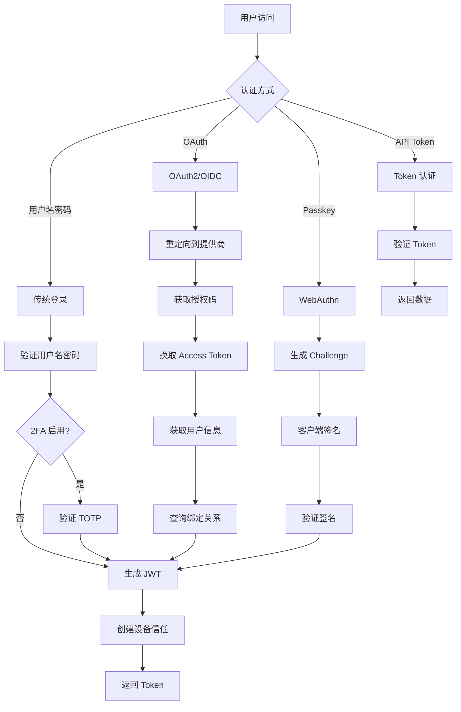
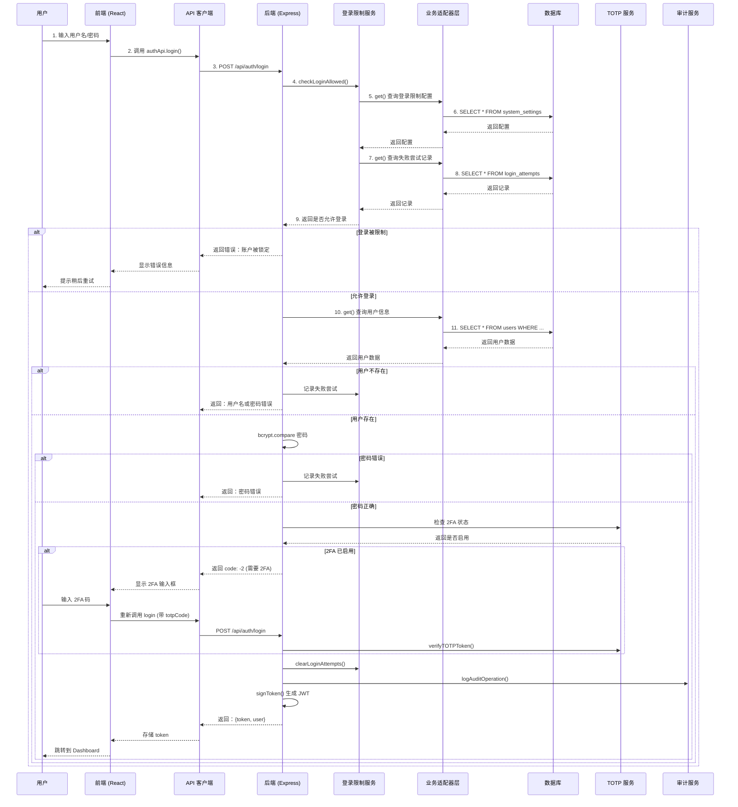

# 用户认证流程

## 认证方式总览

DNSMgr 支持多种认证方式，满足不同安全需求：



## 完整调用链路



## 关键代码路径

### 前端调用链

```
Login.tsx 
  → authApi.login() 
  → api.post('/auth/login') 
  → Axios 拦截器 (添加 Token)
```

### 后端处理链

```
POST /api/auth/login (routes/auth.ts)
  → loginLimiter 中间件 (限流)
  → checkLoginAllowed() (service/loginLimit.ts)
  → get() 查询用户 (通过业务适配器层)
  → bcrypt.compareSync() 验证密码
  → getTOTPStatus() 检查 2FA (service/totp.ts)
  → verifyTOTPToken() 验证 2FA 码
  → clearLoginAttempts() 清除记录 (service/loginLimit.ts)
  → signToken() 生成 JWT (middleware/auth.ts)
  → logAuditOperation() 记录审计 (service/audit.ts)
  → 返回 {token, user}
```

## 数据流

```
用户输入
  ↓
前端表单验证
  ↓
authApi.login(username, password)
  ↓
POST /api/auth/login
  ↓
[后端] loginLimiter 中间件
  ↓
[后端] checkLoginAllowed() - 检查登录限制
  ↓
[后端] get() - 查询用户 (通过业务适配器层)
  ↓
[后端] bcrypt.compare() - 验证密码
  ↓
[后端] getTOTPStatus() - 检查 2FA
  ↓
[后端] verifyTOTPToken() - 验证 2FA 码 (如果需要)
  ↓
[后端] clearLoginAttempts() - 清除失败记录
  ↓
[后端] signToken() - 生成 JWT
  ↓
[后端] logAuditOperation() - 记录审计日志
  ↓
返回 {token, user}
  ↓
前端存储 token 到 localStorage
  ↓
更新 AuthContext
  ↓
重定向到 Dashboard
```
