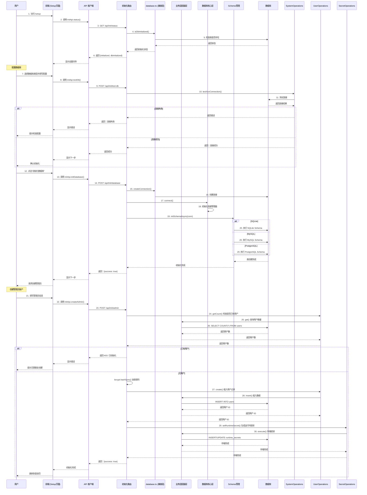

# 数据库初始化流程

## 完整调用链路



## 关键代码路径

### 检查初始化状态

**前端：**
```
Setup.tsx
  → initApi.status()
  → api.get('/init/status')
```

**后端：**
```
GET /api/init/status (routes/init.ts)
  → isDbInitialized() (db/database.ts)
    → 检查表是否存在
  → hasUsers() (db/database.ts)
    → SELECT COUNT(*) FROM users
  → 返回 {initialized, dbInitialized, hasUsers}
```

### 测试数据库连接

**后端：**
```
POST /api/init/test-db (routes/init.ts)
  → 根据 DB_TYPE 调用对应测试方法
  → SystemOperations.testSqliteConnection() / testMysqlConnection() / testPostgresqlConnection()
    → 创建测试连接
    → 检查是否有现有数据
    → 关闭测试连接
  → 返回 {success, message, hasExistingData}
```

### 初始化数据库

**后端：**
```
POST /api/init/database (routes/init.ts)
  → createConnection() (db/database.ts) - 创建传统连接
  → connect() (db/core/connection.ts) - 初始化新系统
  → initSchemaAsync() (db/schema.ts)
    → 根据 DB_TYPE 选择 Schema
    → 执行 CREATE TABLE 语句
  → 返回 {success: true}
```

### 创建管理员

**后端：**
```
POST /api/init/admin (routes/init.ts)
  → UserOperations.getCount() - 检查是否已有用户
  → bcrypt.hashSync() - 加密密码
  → UserOperations.create() - 创建用户 (通过业务适配器层)
  → SecretOperations.setRuntimeSecret() - 生成运行时密钥
  → 返回 {success: true}
```

## 数据流

```
用户访问 /setup
  ↓
前端调用 initApi.status()
  ↓
后端检查数据库和用户状态
  ↓
显示初始化向导
  ↓
用户配置数据库
  ↓
测试数据库连接
  ↓
初始化数据库表结构
  ↓
创建管理员账户
  ↓
生成运行时密钥
  ↓
初始化完成，跳转到登录页
```

## 注意事项

1. **双层初始化**: 系统同时支持传统数据库层和新的业务适配器层
2. **Schema 兼容性**: 根据数据库类型（SQLite/MySQL/PostgreSQL）执行对应的 Schema
3. **运行时密钥**: 初始化完成后自动生成，用于 JWT 签名
4. **幂等性**: 已初始化的系统拒绝重复初始化
