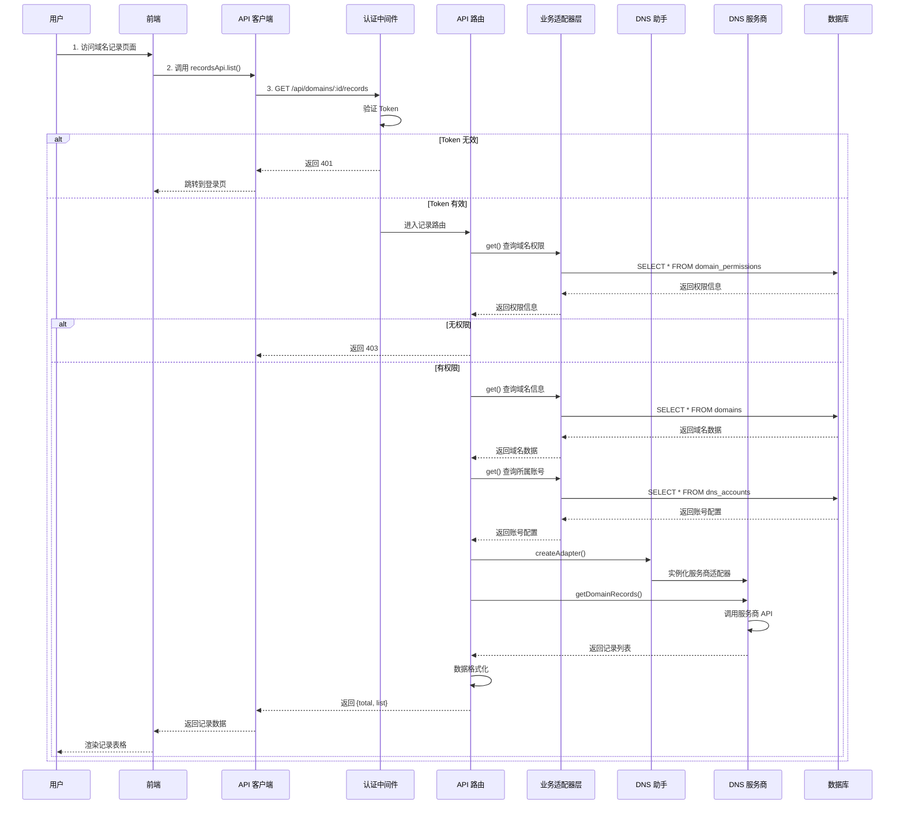
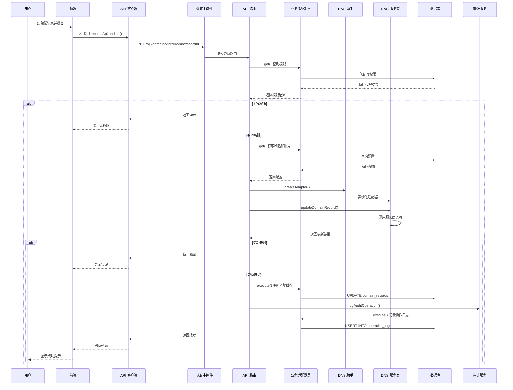

# DNS 记录管理流程

## Cloudflare 特殊处理流程

Cloudflare 提供商支持代理模式（Proxy）和 CNAME 拉平，需要特殊处理：

```mermaid
sequenceDiagram
    participant User as 用户
    participant Frontend as 前端
    participant Backend as 后端
    participant Adapter as 业务适配器
    participant DnsHelper as DNS助手
    Provider as Cloudflare适配器
    participant Cache as 本地缓存
    
    User->>Frontend: 编辑记录
    Frontend->>Backend: PUT /domains/:id/records/:rid
    Backend->>Adapter: 验证权限
    Adapter-->>Backend: 权限通过
    
    Backend->>DnsHelper: createAdapter('cloudflare')
    DnsHelper->>Provider: 实例化适配器
    
    alt 提供 cloudflare.proxied
        Provider->>Provider: 使用 proxied 字段
        Provider->>Provider: 忽略 line 字段
    else 未提供 proxied
        Provider->>Provider: 转换 line 字段
        Provider->>Provider: '1' = proxied, '0' = DNS only
    end
    
    Provider->>Provider: 调用 Cloudflare API
    Provider-->>Backend: 更新结果
    
    Backend->>Cache: 更新本地缓存
    Backend->>Adapter: 记录审计日志
    Backend-->>Frontend: 返回成功
    Frontend-->>User: 刷新列表
```

## 获取记录列表



## 更新记录



## 关键代码路径

### 获取记录列表

**前端：**
```
Records.tsx
  → useQuery(['records', domainId], () => recordsApi.list(domainId))
  → recordsApi.list(domainId, params)
  → api.get(`/domains/${domainId}/records`)
```

**后端：**
```
GET /api/domains/:domainId/records (routes/records.ts)
  → authMiddleware (认证)
  → 检查域名权限
  → get() 查询域名信息 (通过业务适配器层)
  → get() 查询账号配置 (通过业务适配器层)
  → createAdapter() 创建 DNS 适配器
  → adapter.getDomainRecords() 调用服务商 API
  → 格式化返回数据
  → 返回 {total, list}
```

### 更新记录

**前端：**
```
RecordForm.tsx
  → recordsApi.update(domainId, recordId, data)
  → api.put(`/domains/${domainId}/records/${recordId}`)
```

**后端：**
```
PUT /api/domains/:domainId/records/:recordId (routes/records.ts)
  → authMiddleware (认证)
  → 检查写权限
  → get() 查询域名和账号 (通过业务适配器层)
  → createAdapter() 创建 DNS 适配器
  → adapter.updateDomainRecord() 调用服务商 API
  → execute() 更新本地数据库 (通过业务适配器层)
  → logAuditOperation() 记录审计
  → 返回成功
```

## 数据流

### DNS 记录创建

```
用户填写记录表单
  ↓
前端表单验证
  ↓
recordsApi.create(domainId, recordData)
  ↓
POST /api/domains/:domainId/records
  ↓
[后端] authMiddleware - JWT 验证
  ↓
[后端] 检查域名权限
  ↓
[后端] get() - 查询域名信息 (通过业务适配器层)
  ↓
[后端] get() - 查询账号配置 (通过业务适配器层)
  ↓
[后端] createAdapter() - 创建 DNS 适配器
  ↓
[后端] adapter.addDomainRecord() - 调用服务商 API
  ↓
[后端] insert() - 更新本地数据库 (通过业务适配器层)
  ↓
[后端] logAuditOperation() - 记录审计日志
  ↓
返回 {id}
  ↓
前端刷新记录列表
  ↓
显示成功提示
```
