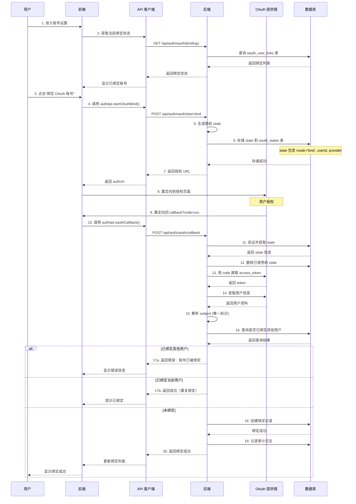

# OAuth 账号绑定流程

## 概述

OAuth 账号绑定允许用户将第三方身份提供商（如 Logto）的账号与 DNSMgr 本地账号关联，实现快捷登录。

## 绑定流程



## 关键代码路径

### 开始绑定流程

**前端**:
```
SecuritySettings.tsx
  → authApi.startOAuthBind(provider)
  → api.post('/auth/oauth/start-bind', { provider })
```

**后端**:
```
POST /api/auth/oauth/start-bind (routes/auth.ts)
  → authMiddleware (验证用户登录)
  → SettingsOperations.get() 获取 OAuth 配置
  → randomHex() 生成 state
  → OAuthOperations.createState() 存储到数据库
  → 返回 { authUrl }
```

### 回调处理

**前端**:
```
OAuthCallback.tsx
  → 从 URL 提取 code 和 state
  → authApi.oauthCallback({ code, state, provider })
  → api.post('/auth/oauth/callback', { code, state })
```

**后端**:
```
POST /api/auth/oauth/callback (routes/auth.ts)
  → OAuthOperations.getAndDeleteState() 验证 state
  → exchangeOauthCode() 换取 access_token
  → fetchOAuthProfile() 获取用户信息
  → verifyIdToken() 验证 ID Token (容错模式)
  → resolveOAuthSubject() 解析用户标识
  → OAuthOperations.getUserByProviderSubject() 查询绑定状态
  → 如果未绑定：OAuthOperations.create() 创建绑定
  → logAuditOperation() 记录审计日志
  → 返回成功
```

## 数据库存储

### oauth_states 表（临时状态）

```sql
CREATE TABLE oauth_states (
  state VARCHAR(255) PRIMARY KEY,
  mode VARCHAR(20) NOT NULL,      -- 'login' 或 'bind'
  provider VARCHAR(100) NOT NULL,
  user_id INT,                    -- bind 模式时有值
  expires_at DATETIME NOT NULL,   -- 10分钟后过期
  created_at DATETIME DEFAULT CURRENT_TIMESTAMP
);
```

### oauth_user_links 表（绑定关系）

```sql
CREATE TABLE oauth_user_links (
  id INT AUTO_INCREMENT PRIMARY KEY,
  user_id INT NOT NULL,           -- DNSMgr 用户ID
  provider VARCHAR(100) NOT NULL, -- 提供商名称
  subject VARCHAR(255) NOT NULL,  -- OAuth 用户唯一标识
  email VARCHAR(255),             -- OAuth 用户邮箱
  created_at DATETIME DEFAULT CURRENT_TIMESTAMP,
  UNIQUE KEY unique_provider_subject (provider, subject),
  UNIQUE KEY unique_user_provider (user_id, provider)
);
```

## 安全机制

### 1. State 验证

- 随机生成的 state 存储在数据库中
- 一次性使用，验证后立即删除
- 10分钟过期时间
- 防止 CSRF 攻击

### 2. 绑定冲突检查

```typescript
// 检查是否已绑定其他用户
const existingLink = await OAuthOperations.getUserByProviderSubject(provider, subject);

if (existingLink && existingLink.id !== currentUserId) {
  // 错误：该 OAuth 账号已绑定到其他用户
  throw new Error('This OAuth account is already bound to another user');
}

if (existingLink && existingLink.id === currentUserId) {
  // 该账号已绑定到当前用户，视为成功
  return { mode: 'bind' };
}

// 创建新绑定
await OAuthOperations.create(currentUserId, provider, subject, email);
```

### 3. 权限控制

- 只有登录用户才能发起绑定
- 绑定操作只能绑定到自己的账号
- 管理员无法强制绑定其他用户的 OAuth 账号

## 与登录流程的区别

| 特性 | 登录流程 | 绑定流程 |
|------|---------|---------|
| 入口 | 登录页面 | 账号设置页面 |
| 用户状态 | 未登录 | 已登录 |
| state 内容 | mode='login' | mode='bind', userId=xxx |
| 成功后 | 返回 JWT Token | 创建绑定记录 |
| 失败处理 | 提示绑定账号 | 显示错误信息 |

## 错误处理

### 常见错误

**1. State 不存在或已过期**
```json
{
  "code": 400,
  "msg": "Invalid oauth state - state not found. Server may have restarted or callback was already processed."
}
```

**2. 账号已绑定到其他用户**
```json
{
  "code": 409,
  "msg": "This OAuth account is already bound to another user"
}
```

**3. OAuth 配置不完整**
```json
{
  "code": 400,
  "msg": "OAuth config is incomplete"
}
```

## 解绑流程

```http
DELETE /api/auth/oauth/bindings/:provider
Authorization: Bearer <jwt-token>
```

**后端处理**:
```
→ authMiddleware 验证用户
→ OAuthOperations.delete(userId, provider)
→ 删除 oauth_user_links 表中对应记录
→ logAuditOperation 记录解绑日志
→ 返回成功
```

## 最佳实践

### 1. 一个用户绑定多个提供商

```
用户 A:
  - 绑定 Logto 账号 (provider='logto', subject='xxx')
  - 绑定 Google 账号 (provider='google', subject='yyy')
  - 绑定 GitHub 账号 (provider='github', subject='zzz')
```

### 2. 一个提供商只能绑定一个账号

```sql
UNIQUE KEY unique_user_provider (user_id, provider)
```

防止一个用户重复绑定同一提供商的多个账号。

### 3. 解绑后重新绑定

- 解绑不会删除 OAuth 提供商端的授权
- 用户可以随时重新绑定同一账号
- 重新绑定会创建新的绑定记录

## 故障排查

### 绑定失败

**检查清单**:
1. OAuth 配置是否正确（clientId, clientSecret, 回调地址）
2. 数据库 oauth_states 表是否存在
3. state 是否过期（10分钟）
4. 该 OAuth 账号是否已绑定其他用户

### 日志查看

```
[OAuth] State created for bind { state: '...', provider: 'logto', userId: 1 }
[OAuth] Callback received { code: '...', state: '...' }
[OAuth] State found and removed { state: '...' }
[OAuth] State validated { mode: 'bind', provider: 'logto', userId: 1 }
[BusinessAdapter] Command executed { operation: 'OAuth.create' }
```
