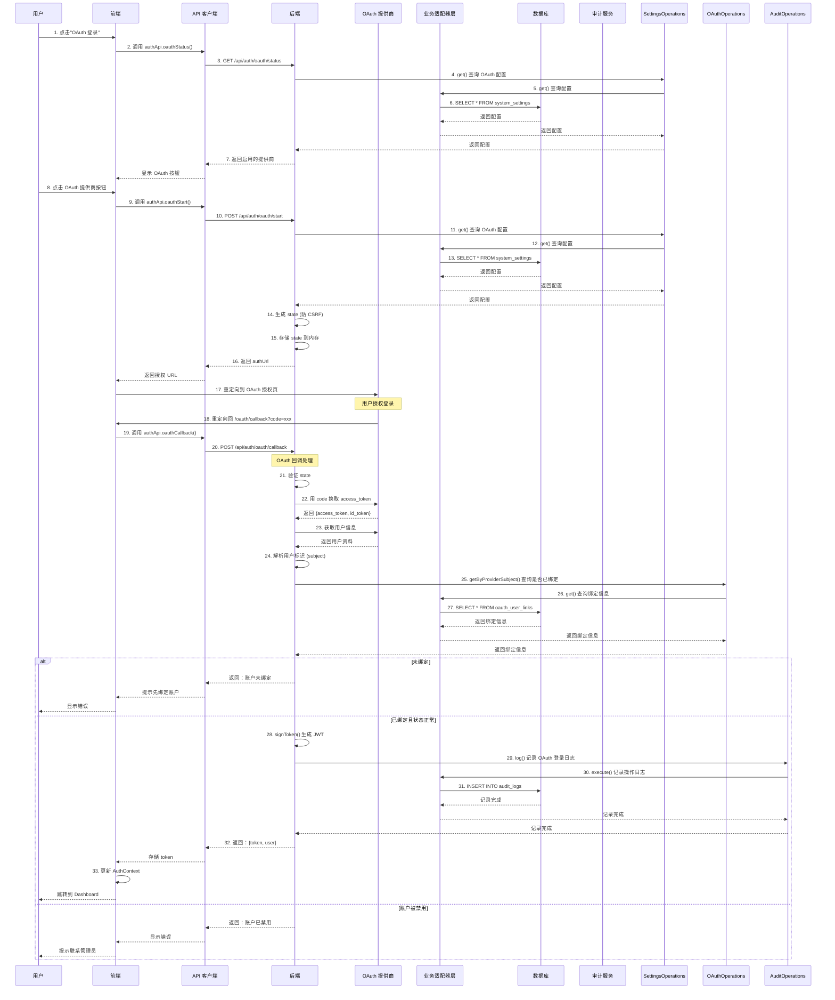

# OAuth 登录流程

## 完整调用链路



## 关键代码路径

### 获取 OAuth 状态

**前端：**
```
Login.tsx
  → authApi.oauthStatus()
  → api.get('/auth/oauth/status')
```

**后端：**
```
GET /api/auth/oauth/status (routes/auth.ts)
  → SettingsOperations.get('oauth_config') / get('oauth_logto_config')
  → 返回启用的提供商列表
```

### 开始 OAuth 流程

**前端：**
```
Login.tsx
  → authApi.oauthStart(provider)
  → api.post('/auth/oauth/start')
```

**后端：**
```
POST /api/auth/oauth/start (routes/auth.ts)
  → SettingsOperations.get() 获取 OAuth 配置
  → randomHex() 生成 state
  → 存储 state 到 oauthStateStore (内存 Map)
  → 构建授权 URL
  → 返回 {authUrl}
```

### OAuth 回调处理

**前端：**
```
OAuthCallback.tsx
  → 从 URL 提取 code 和 state
  → authApi.oauthCallback({code, state, provider})
  → api.post('/auth/oauth/callback')
```

**后端：**
```
POST /api/auth/oauth/callback (routes/auth.ts)
  → 验证 state (防止 CSRF)
  → exchangeOauthCode() 用 code 换取 access_token
  → fetchOAuthProfile() 获取用户信息
  → 解析 subject (用户唯一标识)
  → OAuthOperations.getUserByProviderSubject() 查询绑定
  → 如果已绑定：
    → signToken() 生成 JWT
    → AuditOperations.log() 记录审计日志
    → 返回 {token, user}
  → 如果未绑定：
    → 返回错误提示绑定账户
```

## 数据流

```
用户点击 OAuth 登录
  ↓
前端获取 OAuth 状态
  ↓
显示可用的 OAuth 提供商
  ↓
用户选择提供商
  ↓
后端生成 state 并返回授权 URL
  ↓
重定向到 OAuth 提供商授权页
  ↓
用户授权
  ↓
重定向回应用 callback
  ↓
用 code 换取 access_token
  ↓
获取用户信息
  ↓
查询是否已绑定本地账户
  ↓
如果已绑定：生成 JWT 并登录
如果未绑定：提示绑定账户
```

## 安全机制

1. **State 验证**: 防止 CSRF 攻击
2. **Code 一次性使用**: 授权码只能使用一次
3. **PKCE 支持**: 可选的 PKCE 流程增强安全性
4. **Token 验证**: 验证 ID Token 的签名和声明

## 支持的 OAuth 提供商

- **通用 OAuth2/OIDC**: 支持任意标准 OAuth2/OIDC 提供商
- **Logto**: 针对 Logto 平台的优化配置
