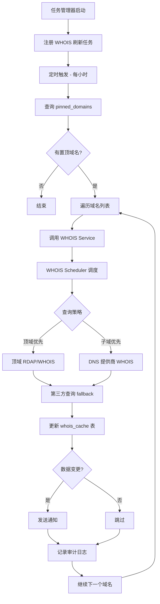
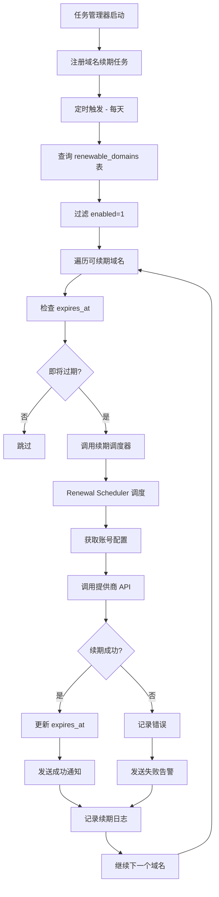
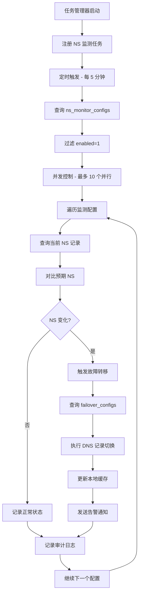
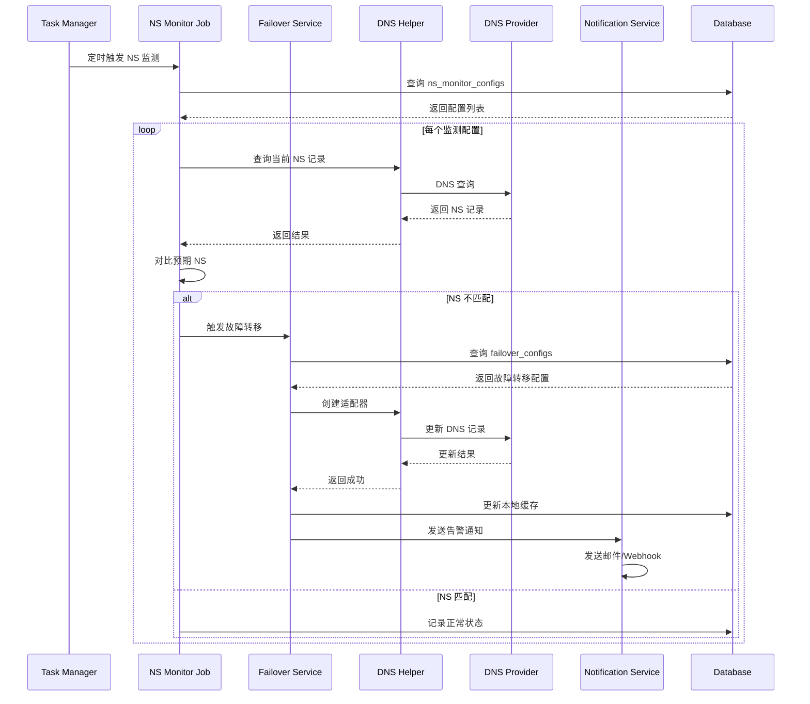
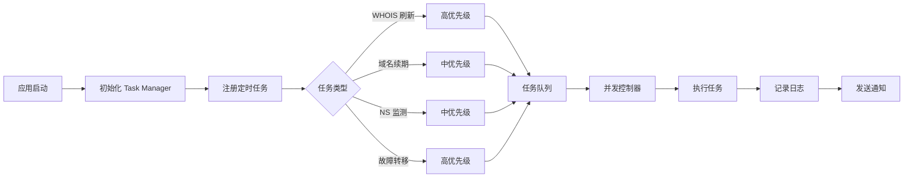

# 定时任务工作流程

## 任务管理器架构

DNSMgr 使用统一的任务管理器来调度和执行所有后台定时任务，确保并发控制和优先级管理。

## WHOIS 缓存刷新流程



### 关键代码路径

**后端:**
```
taskManager.ts (定时任务注册)
  → whoisJob.ts (WHOIS 刷新任务)
  → whoisService.ts (WHOIS 查询服务)
  → whoisScheduler.ts (调度器接口)
  → providers/dnshe/whoisScheduler.ts (具体实现)
  → Business Adapter (更新 whois_cache 表)
```

## 域名续期检查流程



### 关键代码路径

**后端:**
```
taskManager.ts (定时任务注册)
  → domainRenewalJob.ts (续期检查任务)
  → renewalScheduler.ts (续期调度器接口)
  → providers/dnshe/scheduler.ts (具体实现)
  → Business Adapter (更新 renewable_domains 表)
  → notification.ts (发送通知)
```

## NS 监测流程



### 关键代码路径

**后端:**
```
taskManager.ts (定时任务注册)
  → nsMonitorJob.ts (NS 监测任务)
  → Business Adapter (查询 ns_monitor_configs)
  → DNS Helper (查询 NS 记录)
  → failover.ts (故障转移逻辑)
  → notification.ts (发送告警)
```

## 故障转移执行流程



## 任务管理器调度流程



### 任务优先级机制

- **高优先级**: WHOIS 刷新、故障转移（立即执行，可插队）
- **中优先级**: 域名续期、NS 监测（按顺序执行）
- **低优先级**: 缓存清理、日志归档（空闲时执行）

### 并发控制

- NS 监测: 最多 10 个并行请求
- WHOIS 查询: 最多 5 个并行请求
- 域名续期: 串行执行（避免冲突）

## 数据流总结

```
Task Manager 
  → Scheduled Job 
  → Query Database 
  → Process Data 
  → Call External API (if needed)
  → Update Database 
  → Send Notification 
  → Log Audit
```

## 配置示例

### 环境变量

```bash
# 任务并发控制
TASK_CONCURRENCY_NS=10
TASK_CONCURRENCY_WHOIS=5

# 定时任务间隔（秒）
WHOIS_REFRESH_INTERVAL=3600      # 1 小时
DOMAIN_RENEWAL_INTERVAL=86400    # 24 小时
NS_MONITOR_INTERVAL=300          # 5 分钟
```

### 数据库配置

```sql
-- WHOIS 缓存配置
INSERT INTO system_settings (key, value) 
VALUES ('whois_cache_ttl', '86400');  -- 24 小时

-- 置顶域名
INSERT INTO user_preferences (user_id, preferences) 
VALUES (1, '{"pinned_domains": [1, 2, 3]}');
```
