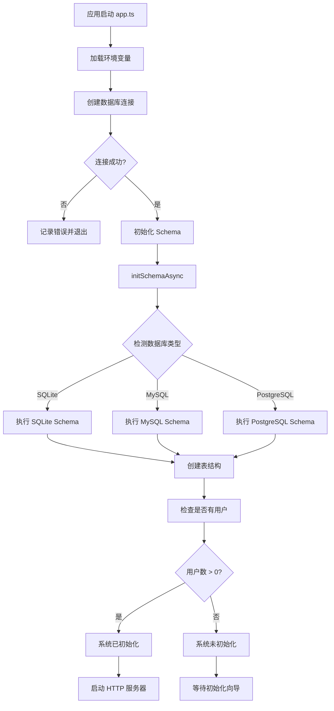
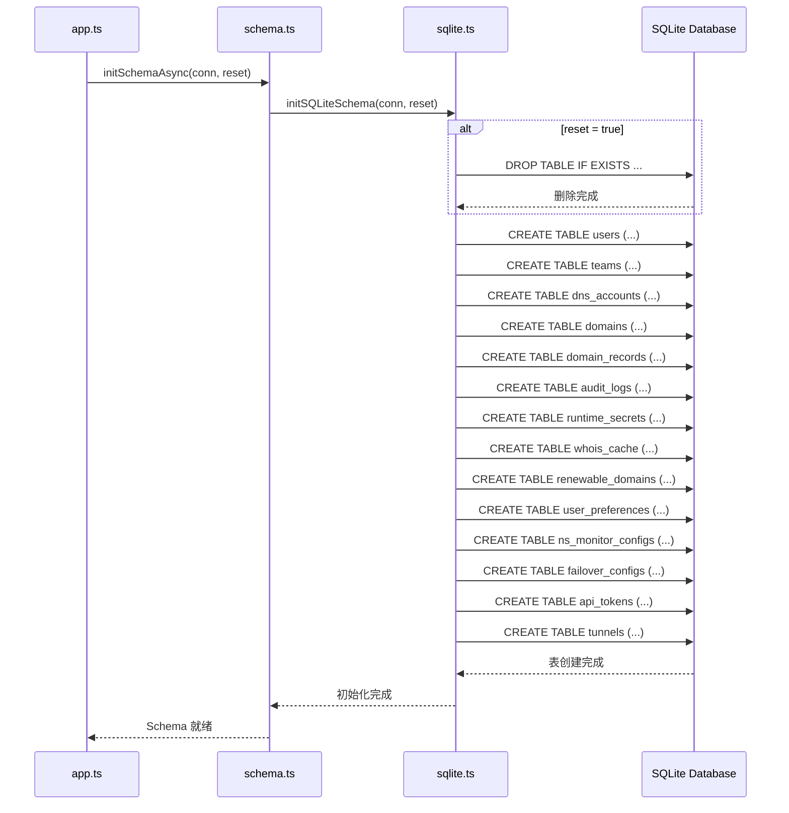
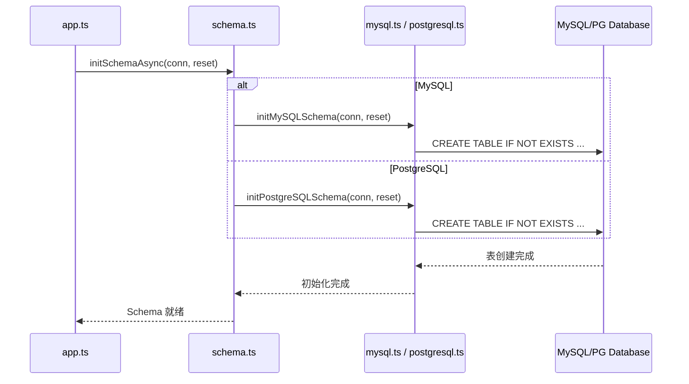
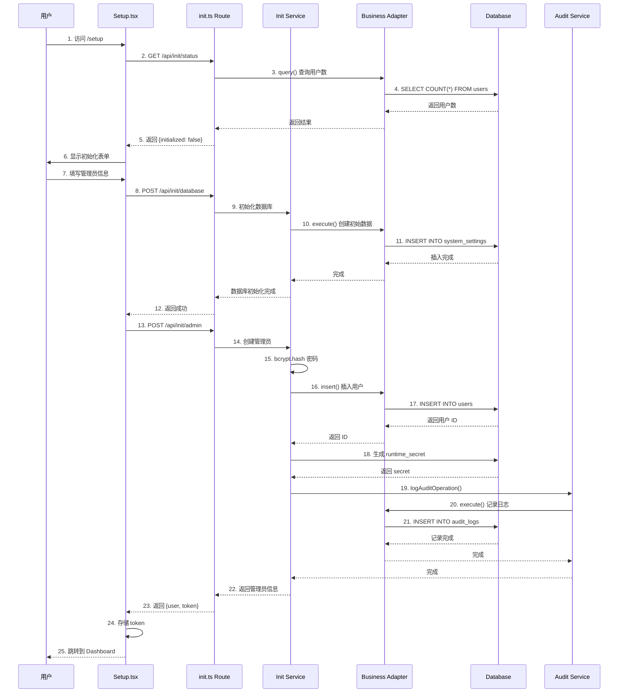
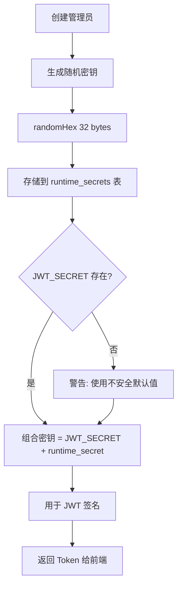
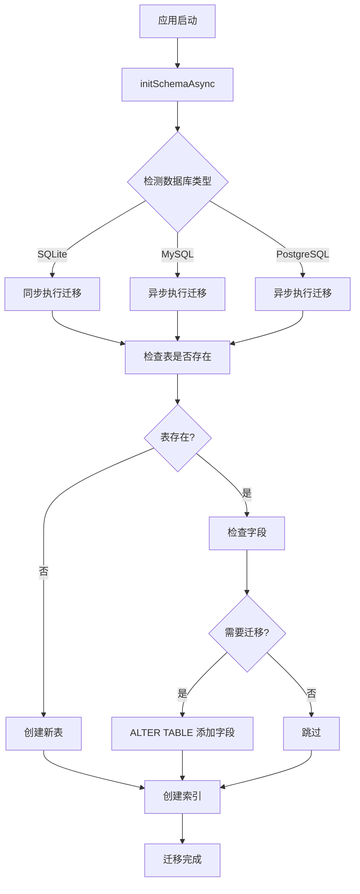

# 系统初始化流程

## 首次启动检测流程



## 数据库初始化流程

### SQLite 初始化



### MySQL/PostgreSQL 初始化



## 管理员创建流程



## 运行时密钥生成流程



### 密钥轮换机制

1. **首次初始化**: 生成 runtime_secret 并存储
2. **管理员创建后**: 主动轮换 runtime_secret
3. **Token 失效**: 旧 Token 因密钥变化而失效
4. **重新登录**: 用户使用新密钥获取新 Token

## Schema 迁移流程

### 自动迁移检测



### 迁移脚本示例

**添加 whois_cache 表:**
```typescript
// server/src/db/schemas/sqlite.ts
conn.exec(`
  CREATE TABLE IF NOT EXISTS whois_cache (
    id INTEGER PRIMARY KEY AUTOINCREMENT,
    domain TEXT NOT NULL UNIQUE,
    data TEXT,
    expires_at DATETIME,
    created_at DATETIME DEFAULT CURRENT_TIMESTAMP,
    updated_at DATETIME DEFAULT CURRENT_TIMESTAMP
  )
`);
```

**添加 pinned_domains 字段:**
```typescript
// PostgreSQL / SQLite
conn.exec(`
  ALTER TABLE user_preferences 
  ADD COLUMN IF NOT EXISTS pinned_domains TEXT
`);

// MySQL
conn.execute(`
  ALTER TABLE user_preferences 
  ADD COLUMN pinned_domains JSON
`);
```

## 初始化状态检查

### API 端点

```
GET /api/init/status
```

**响应示例:**
```json
{
  "initialized": false,
  "database": true,
  "admin_exists": false
}
```

### 初始化保护

- `/api/init/*` 仅在未初始化时可访问
- 已初始化后返回 `403 Forbidden`
- 防止重复初始化和数据覆盖

## 环境变量配置

### 必需变量

```bash
# 数据库配置
DB_TYPE=sqlite          # sqlite / mysql / postgresql
DB_PATH=./dnsmgr.db     # SQLite 数据库路径

# JWT 配置（生产环境必须设置）
JWT_SECRET=your-secret-key-here

# 服务器配置
PORT=3001
NODE_ENV=production
```

### 可选变量

```bash
# MySQL / PostgreSQL 配置
DB_HOST=localhost
DB_PORT=3306
DB_NAME=dnsmgr
DB_USER=root
DB_PASSWORD=password
DB_SSL=false

# SMTP 邮件配置
SMTP_HOST=smtp.example.com
SMTP_PORT=587
SMTP_USER=noreply@example.com
SMTP_PASSWORD=password
```

## 初始化检查清单

- [ ] 数据库连接成功
- [ ] Schema 创建完成
- [ ] 所有核心表存在
- [ ] 索引创建完成
- [ ] 初始数据插入
- [ ] 管理员账户创建
- [ ] runtime_secret 生成
- [ ] 审计日志记录
- [ ] JWT Token 返回
- [ ] 前端跳转成功

## 故障排查

### 常见问题

1. **数据库连接失败**
   - 检查 DB_TYPE 配置
   - 验证数据库服务运行状态
   - 确认网络连接和防火墙设置

2. **Schema 创建失败**
   - 检查数据库权限
   - 查看错误日志定位具体 SQL
   - 手动执行失败的 SQL 语句

3. **管理员创建失败**
   - 检查用户名/邮箱是否唯一
   - 验证密码强度要求
   - 确认 runtime_secret 生成成功

4. **Token 无效**
   - 检查 JWT_SECRET 配置
   - 确认 runtime_secret 已存储
   - 清除浏览器缓存重新登录

### 日志位置

```
server/data/dnsmgr.log      # 应用日志
server/data/dnsmgr.db       # SQLite 数据库
```

## 安全注意事项

1. **JWT_SECRET**: 生产环境必须设置强密钥
2. **runtime_secret**: 自动生成，不要手动修改
3. **管理员密码**: 使用强密码，至少 8 位
4. **初始化接口**: 初始化后自动禁用
5. **审计日志**: 所有初始化操作都记录日志
